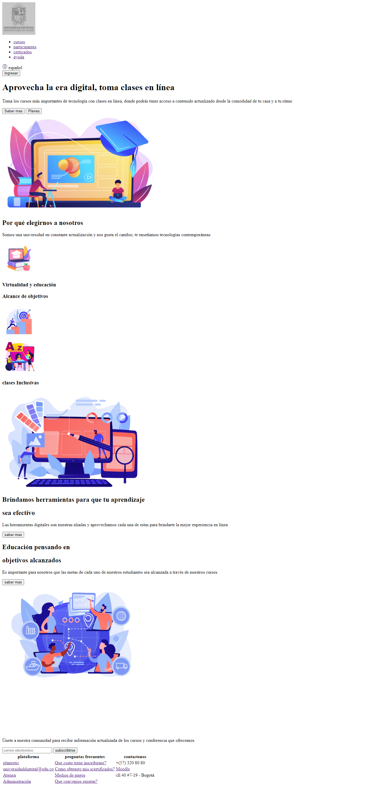

<h1>Taller 9: jeison Blandon</h1>

<h2>Informatica</h2>

curso full stack basico - grupo 1

Profesor: Cristian Patiño

<h3>link pagina web</h3>
<a href="https://jblandoncuesta.github.io/Taller-9-full-stack/" target="_blank">link pagina web</a>

<h2>Punto-1</h2>

<h2>Punto-1: link de figma</h2>

<a href ="https://www.figma.com/file/naafusz2zMKF41nVH3hZdG/jeison-blandon?type=design&node-id=0%3A1&t=S4otvnlKvmC0yubd-1" >Link de figma</a>

<h2>Punto 2</h2>

<h2>Punto 3</h2>

<h2>Punto 4</h2>

<h2>Punto 5</h2>

<h2>Punto 6</h2>

<h2>Punto 7</h2>

<h2>Punto 9</h2>

